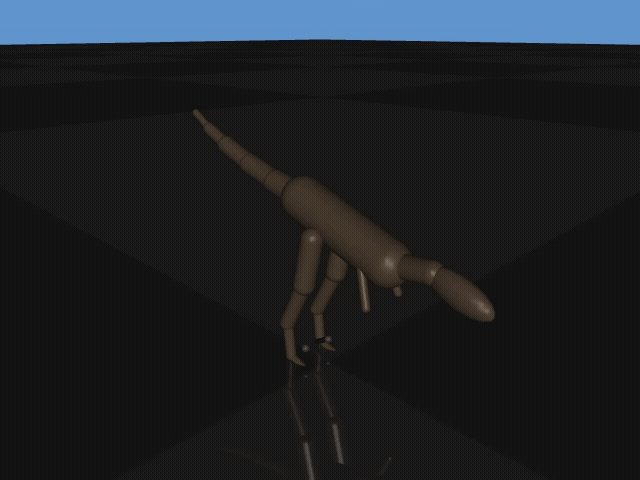

# Mesozoic Labs

Dinosaur-inspired locomotion research using reinforcement learning and MuJoCo physics simulation.



*Historical, unverified PPO / Stable-Baselines3 artifact (backend version not
recorded); not evidence for the current model or configuration.*

## Overview

Mesozoic Labs is a simulation research project exploring bipedal and quadrupedal locomotion with Mesozoic-inspired articulated models. We use MuJoCo for physics-based simulation and train agents with algorithms such as PPO and SAC. The models are research abstractions rather than validated anatomical reconstructions. Most species here are dinosaurs; Dibothrosuchus is a crocodylomorph, included because its erect, long-limbed terrestrial posture is a distinct locomotion problem from the sprawl a modern crocodilian uses.

**Goals:**
- Develop locomotion controllers for dinosaur-inspired simulated species
- Explore predatory behaviors (hunting, striking, pack coordination)
- Study the requirements for eventual policy transfer to robotic platforms
- Experiment with JAX/MJX for high-performance training

## Repository Structure

```
mesozoic-labs/
├── environments/              # Dinosaur training environments
│   ├── velociraptor/          # Velociraptor (bipedal predator with sickle claws)
│   │   ├── assets/            # MJCF model files
│   │   ├── envs/              # Gymnasium environments
│   │   ├── scripts/           # Training & utility scripts
│   │   ├── tests/             # Pytest test suite
│   │   └── README.md
│   ├── brachiosaurus/         # Brachiosaurus (quadrupedal sauropod)
│   │   ├── assets/            # MJCF model files
│   │   ├── envs/              # Gymnasium environments
│   │   ├── scripts/           # Training & utility scripts
│   │   ├── tests/             # Pytest test suite
│   │   └── README.md
│   ├── trex/                  # T-Rex (large bipedal predator)
│   │   ├── assets/            # MJCF model files
│   │   ├── envs/              # Gymnasium environments
│   │   ├── scripts/           # Training & utility scripts
│   │   ├── tests/             # Pytest test suite
│   │   └── README.md
│   ├── dibothrosuchus/        # Dibothrosuchus (erect-limbed crocodylomorph)
│   │   ├── assets/            # MJCF model files
│   │   ├── envs/              # Gymnasium environments
│   │   ├── scripts/           # Training & utility scripts
│   │   ├── tests/             # Pytest test suite
│   │   └── README.md
│   └── shared/                # Shared base classes and utilities
│       ├── base_env.py        # BaseDinoEnv abstract class
│       ├── config.py          # TOML configuration loading
│       ├── curriculum/        # Curriculum manager and SB3 callbacks
│       ├── plant_contract/    # Layered MuJoCo plant safety contract
│       ├── reporting/         # Result summaries, CSVs, and stage artifacts
│       ├── result_bundle/     # Provenance, hashing, and bundle validation
│       ├── train_base.py      # Shared SB3 training infrastructure
│       ├── species_registry.py # Species configuration registry
│       ├── metrics.py         # Locomotion evaluation metrics
│       ├── wandb_integration.py # W&B experiment tracking
│       ├── mjx_env.py         # JAX/MJX batched environment
│       ├── jax_ppo.py         # JAX-native PPO implementation
│       ├── jax_training.py    # JAX training loop
│       ├── harnesses/         # Hand-run smoke checks and MJCF viewers
│       └── tests/             # Shared utility tests
├── configs/                   # TOML hyperparameter configs per species/stage
├── notebooks/                 # Jupyter training, sweep, and reporting workflows
├── website/                   # Documentation site (Docusaurus)
└── results/                   # Curated historical summaries and available run artifacts
```

## Environments

<!-- BEGIN GENERATED: SPECIES -->
The active-species tables are generated from `configs/species_manifest.toml`, the layered plant contract,
the executable Gymnasium environments, compiled MJCF models, and current stage TOML files. The budgets and
gates shown are for the Stable-Baselines3 curriculum path. Do not edit the generated block by hand.

### Velociraptor

Swift Bipedal Predator. **Specialty:** Sickle-claw contact attacks.

| Generated specification | Value |
|---|---|
| Observation dimension | 67 |
| Action dimension / actuators | 22 |
| Generalized coordinates / velocities | nq=31, nv=30 |
| Compiled dynamic model mass | 13.5 kg |
| Plant contract revisions | policy r8; physics r2; visual r3 ([details](docs/PLANT_CONTRACT.md)) |
| Model | `environments/velociraptor/assets/raptor.xml` |

| Current stage | Objective | SB3 configured budget | SB3 early-advancement gate |
|---|---|---:|---:|
| 1 — Balance | Learn to stand and balance without falling | 6M | reward ≥ 100; episode length ≥ 750; ≥ 10 episodes/evaluation; 3 consecutive passes |
| 2 — Locomotion | Learn forward walking/running | 8M | reward ≥ 100; episode length ≥ 750; avg. velocity ≥ 2 m/s; ≥ 10 episodes/evaluation; 3 consecutive passes |
| 3 — Strike | Sprint and strike prey with sickle claw | 12M | reward ≥ 100; task success ≥ 50.0%; ≥ 10 episodes/evaluation; 3 consecutive passes |

**Backend-specific success semantics:**
- **Stable-Baselines3 — Sickle-claw contact success:** A left or right sickle-claw geom contacts the prey geom while the strike reward is enabled.
- **JAX/MJX — Sickle-claw proximity success:** Either claw-tip site comes within 0.20 m of the prey target position while the strike bonus is enabled; physical geom contact is not required.

[Full documentation →](environments/velociraptor/README.md)

[Hugging Face models →](https://huggingface.co/kuds/mesozoic-labs-velocipastor)

### T-Rex

Apex Predator. **Specialty:** Head-contact attack task.

| Generated specification | Value |
|---|---|
| Observation dimension | 61 |
| Action dimension / actuators | 21 |
| Generalized coordinates / velocities | nq=28, nv=27 |
| Compiled dynamic model mass | 85.7 kg |
| Plant contract revisions | policy r9; physics r6; visual r4 ([details](docs/PLANT_CONTRACT.md)) |
| Model | `environments/trex/assets/trex.xml` |

| Current stage | Objective | SB3 configured budget | SB3 early-advancement gate |
|---|---|---:|---:|
| 1 — Balance | Learn to stand and balance without falling | 6M | reward ≥ 1840; episode length ≥ 750; ≥ 10 episodes/evaluation; 3 consecutive passes |
| 2 — Locomotion | Learn forward walking/running | 8M | reward ≥ 100; episode length ≥ 750; avg. velocity ≥ 2 m/s; ≥ 10 episodes/evaluation; 3 consecutive passes |
| 3 — Bite | Sprint to prey and make contact with the head bite proxy | 8M | reward ≥ 100; task success ≥ 50.0%; ≥ 10 episodes/evaluation; 3 consecutive passes |

**Backend-specific success semantics:**
- **Stable-Baselines3 — Head-contact bite proxy:** The head-bite geom contacts the prey geom while the bite reward is enabled; the model has no articulated jaw.
- **JAX/MJX — Head-tip proximity bite proxy:** The head-tip site comes within 0.35 m of the prey target position while the bite bonus is enabled; physical geom contact is not required and the model has no articulated jaw.

[Full documentation →](environments/trex/README.md)

### Brachiosaurus

Gentle Giant Herbivore. **Specialty:** Head-to-food reaching.

| Generated specification | Value |
|---|---|
| Observation dimension | 83 |
| Action dimension / actuators | 30 |
| Generalized coordinates / velocities | nq=38, nv=37 |
| Compiled dynamic model mass | 175.3 kg |
| Plant contract revisions | policy r6; physics r4; visual r2 ([details](docs/PLANT_CONTRACT.md)) |
| Model | `environments/brachiosaurus/assets/brachiosaurus.xml` |

| Current stage | Objective | SB3 configured budget | SB3 early-advancement gate |
|---|---|---:|---:|
| 1 — Balance | Learn to stand on four legs without falling | 6M | reward ≥ 100; episode length ≥ 750; ≥ 10 episodes/evaluation; 3 consecutive passes |
| 2 — Locomotion | Learn coordinated quadrupedal walking | 16M | reward ≥ 100; episode length ≥ 750; avg. velocity ≥ 0.75 m/s; ≥ 10 episodes/evaluation; 3 consecutive passes |
| 3 — Food Reach | Move the head tip within the configured distance threshold of food | 12M | reward ≥ 100; task success ≥ 50.0%; ≥ 10 episodes/evaluation; 3 consecutive passes |

**Backend-specific success semantics:**
- **Stable-Baselines3 / JAX/MJX — Head-tip distance-threshold success:** The head-tip site comes within the configured food-reach threshold of the food target while the food-reach bonus is enabled.

[Full documentation →](environments/brachiosaurus/README.md)

### Dibothrosuchus

Gracile Erect-Limbed Crocodylomorph. **Specialty:** Snout-contact snap task.

| Generated specification | Value |
|---|---|
| Observation dimension | 77 |
| Action dimension / actuators | 27 |
| Generalized coordinates / velocities | nq=35, nv=34 |
| Compiled dynamic model mass | 8.7 kg |
| Plant contract revisions | policy r5; physics r1; visual r1 ([details](docs/PLANT_CONTRACT.md)) |
| Model | `environments/dibothrosuchus/assets/dibothrosuchus.xml` |

| Current stage | Objective | SB3 configured budget | SB3 early-advancement gate |
|---|---|---:|---:|
| 1 — Balance | Hold the erect quadrupedal stance without collapsing into a sprawl | 6M | reward ≥ 100; episode length ≥ 750; ≥ 10 episodes/evaluation; 3 consecutive passes |
| 2 — Locomotion | Learn a coordinated erect-limbed diagonal-pair walk | 12M | reward ≥ 100; episode length ≥ 750; avg. velocity ≥ 0.9 m/s; ≥ 10 episodes/evaluation; 3 consecutive passes |
| 3 — Snap | Close on small prey and touch it with the snout snap proxy | 8M | reward ≥ 100; task success ≥ 50.0%; ≥ 10 episodes/evaluation; 3 consecutive passes |

**Backend-specific success semantics:**
- **Stable-Baselines3 — Snout-contact snap proxy:** The snout snap geom contacts the prey geom while the snap reward is enabled; the model has no articulated jaw.
- **JAX/MJX — Snout-tip proximity snap proxy:** The snout-tip site comes within 0.12 m of the prey target position while the snap bonus is enabled; physical geom contact is not required and the model has no articulated jaw.

[Full documentation →](environments/dibothrosuchus/README.md)
<!-- END GENERATED: SPECIES -->

### Planned Species
- Deinonychus (pack hunter)
- Compsognathus (small, fast biped)
- Stegosaurus (armored quadrupedal defender)

## Quick Start

```bash
# Clone and setup
git clone https://github.com/kuds/mesozoic-labs.git
cd mesozoic-labs

python -m venv venv
source venv/bin/activate

# Install the package with training dependencies
pip install -e ".[train]"

# View the velociraptor model
python environments/velociraptor/scripts/view_model.py

# Full 3-stage curriculum — one command, all stages handled automatically
# (each stage loads its own hyperparameters from the TOML config)
cd environments/velociraptor
python scripts/train_sb3.py curriculum --algorithm ppo
```

## Docker

The repo ships a `Dockerfile` that bundles MuJoCo, Stable-Baselines3, and all training dependencies:

```bash
# Build
docker build -t mesozoic-labs:latest .

# Quick smoke-test (no GPU needed)
docker run --rm mesozoic-labs:latest \
  environments/velociraptor/scripts/train_sb3.py \
  train --stage 1 --timesteps 1000 --n-envs 1

# Full curriculum with GPU, writing outputs to local disk
docker run --rm --gpus all \
  -v "$(pwd)/outputs:/app/outputs" \
  mesozoic-labs:latest \
  environments/velociraptor/scripts/train_sb3.py \
  curriculum --algorithm ppo --n-envs 4 --output-dir /app/outputs/velociraptor
```

See [Vertex AI training docs](website/docs/training/vertex-ai.md) for cloud deployment.

## Training Results

<!-- BEGIN GENERATED: RESULTS -->
The summaries below are historical experiment records generated from the versioned JSON files under
`results/`. They are not evidence for the current model revision unless provenance is marked both current
and verified. Current stage budgets may therefore differ from the steps reported here.

### Velociraptor (PPO · Stable-Baselines3) — 2026-03-15

**Provenance:** Historical model; unverified; evaluation episode count not recorded; Stable-Baselines3 (version not recorded). **Run total:** 22M steps; 11:25:15. [Source summary](results/velociraptor/ppo/summary.json).

| Stage | Best eval reward | Avg. forward velocity | Task success | Trained steps | Passed |
|---|---:|---:|---:|---:|---:|
| 1 — Balance | 1964.43 | 0.11 m/s | — | 6M | Yes |
| 2 — Locomotion | 2678.68 | 3.47 m/s | — | 8M | Yes |
| 3 — Strike | 1366.19 | 2.02 m/s | 93.3% | 8M | Yes |

**Current Stable-Baselines3 catalog definition for this task label:** A left or right sickle-claw geom contacts the prey geom while the strike reward is enabled.

### Velociraptor (SAC · Stable-Baselines3) — 2026-03-21

**Provenance:** Historical model; unverified; evaluation episode count not recorded; Stable-Baselines3 (version not recorded). **Run total:** 22M steps; 22:59:18. [Source summary](results/velociraptor/sac/summary.json).

| Stage | Best eval reward | Avg. forward velocity | Task success | Trained steps | Passed |
|---|---:|---:|---:|---:|---:|
| 1 — Balance | 970.19 | -0.64 m/s | — | 6M | Yes |
| 2 — Locomotion | 2078.62 | 2.91 m/s | — | 8M | Yes |
| 3 — Strike | 1195.43 | 1.63 m/s | 90.0% | 8M | Yes |

**Current Stable-Baselines3 catalog definition for this task label:** A left or right sickle-claw geom contacts the prey geom while the strike reward is enabled.

### T-Rex (PPO · Stable-Baselines3) — 2026-03-18

**Provenance:** Historical model; unverified; evaluation episode count not recorded; Stable-Baselines3 (version not recorded). **Run total:** 22M steps; 13:02:32. [Source summary](results/trex/ppo/summary.json).

| Stage | Best eval reward | Avg. forward velocity | Task success | Trained steps | Passed |
|---|---:|---:|---:|---:|---:|
| 1 — Balance | 3008.66 | 0.02 m/s | — | 6M | Yes |
| 2 — Locomotion | 1936.01 | 3.47 m/s | — | 8M | Yes |
| 3 — Bite | 1294.28 | 1.68 m/s | 96.7% | 8M | Yes |

**Current Stable-Baselines3 catalog definition for this task label:** The head-bite geom contacts the prey geom while the bite reward is enabled; the model has no articulated jaw.

### Brachiosaurus (PPO · Stable-Baselines3) — 2026-07-18

**Provenance:** Historical model; unverified; 30 evaluation episodes; Stable-Baselines3 (version not recorded). **Run total:** 34.0214M steps; 19:46:16. [Source summary](results/brachiosaurus/ppo/summary.json).

| Stage | Best eval reward | Avg. forward velocity | Task success | Trained steps | Passed |
|---|---:|---:|---:|---:|---:|
| 1 — Balance | 1740.53 | 0.01 m/s | — | 6.00474M | Yes |
| 2 — Locomotion | 6634.60 | 1.42 m/s | 3.3% | 16.0072M | Yes |
| 3 — Food Reach | 1368.13 | 0.71 m/s | 100.0% | 12.0095M | Yes |

**Current Stable-Baselines3 catalog definition for this task label:** The head-tip site comes within the configured food-reach threshold of the food target while the food-reach bonus is enabled.
<!-- END GENERATED: RESULTS -->

## Notebooks

<!-- BEGIN GENERATED: NOTEBOOKS -->
| Notebook | Description |
|---|---|
| [`notebooks/sb3_training.ipynb`](notebooks/sb3_training.ipynb) | Train and evaluate species with Stable-Baselines3. |
| [`notebooks/jax_training.ipynb`](notebooks/jax_training.ipynb) | Train and evaluate species with the JAX/MJX backend. |
| [`notebooks/ray_tune_sweep.ipynb`](notebooks/ray_tune_sweep.ipynb) | Run distributed hyperparameter sweeps with Ray Tune. |
| [`notebooks/google_drive_summary.ipynb`](notebooks/google_drive_summary.ipynb) | Collect and summarize training artifacts from Google Drive. |
<!-- END GENERATED: NOTEBOOKS -->

## Roadmap

- [x] Publish historical Velociraptor PPO and SAC run summaries
- [x] Publish a historical T-Rex PPO run summary
- [-] Continue Brachiosaurus Stage 3 training and publish a provenance-complete run
- [-] SAC training for T-Rex (a historical, unverified Velociraptor SAC summary is published)
- [ ] Domain randomization (friction, damping, gravity, actuator strength, external pushes, observation noise)
- [ ] Terrain adaptation (uneven ground, obstacles)
- [-] JAX/MJX migration for faster training (PPO pipeline complete, SAC pending)
- [-] mjlab pilot (MuJoCo-Warp + Isaac-Lab manager API) — scaffold landed, velociraptor Stage 1 spike pending
- [ ] Multi-agent pack hunting scenarios
- [ ] Sim-to-real transfer experiments (future work; no hardware-transfer results are published yet)

See [docs/ROADMAP.md](docs/ROADMAP.md) for the full phased timeline, milestones, and dependency graph.

## Resources

- **Documentation:** [mesozoiclabs.com](https://mesozoiclabs.com)
- **Blog:** [From Zero to Dino-Roar](https://www.findingtheta.com/blog/from-zero-to-dino-roar-teaching-a-t-rex-to-walk-with-mujoco-and-reinforcement-learning)

## Development

```bash
# Install with all dev dependencies
pip install -e ".[all]"

# Run tests
pytest

# Lint and type check
ruff check environments/
mypy environments/

# Regenerate public species data and README tables after changing a model,
# stage config, manifest entry, notebook path, video, or result summary
python -m environments.shared.species_catalog

# Verify committed generated data without rewriting it
python -m environments.shared.species_catalog --check
```

## Contributing

Contributions welcome! See [CONTRIBUTING.md](CONTRIBUTING.md) for guidelines.

## Citation

If you use Mesozoic Labs in your research, please cite:

```bibtex
@software{mesozoic_labs,
  title     = {Mesozoic Labs: Dinosaur Locomotion via Reinforcement Learning},
  author    = {Michael Kudlaty},
  year      = {2025},
  url       = {https://github.com/kuds/mesozoic-labs},
  license   = {MIT}
}
```

## License

MIT License
