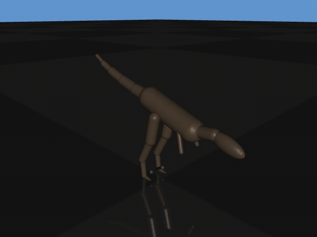

# Mesozoic Labs

Dinosaur-inspired locomotion research using reinforcement learning and MuJoCo physics simulation.



*Velociraptor balance policy trained with PPO. Historical, unverified Stable-Baselines3 artifact (backend version
not recorded); not evidence for the current model or configuration.*

Mesozoic Labs is a set of [Gymnasium](https://gymnasium.farama.org) environments built on
[MuJoCo](https://mujoco.org), with a pipeline that trains agents in them with PPO or SAC from
[Stable-Baselines3](https://stable-baselines3.readthedocs.io). Most of its articulated models are dinosaurs; one is a
twelve-servo robot version of Compsognathus, and one is the crocodylomorph Dibothrosuchus, whose erect, long-limbed
posture is a different locomotion problem from the sprawl of a modern crocodilian. The models are research
abstractions rather than validated anatomical reconstructions.

Each model learns a small set of behaviors, such as stand, walk and hunt (a species task such as a claw strike or a
reach for food). Each behavior is a policy of its own, checked against its own gate and published on its own, and it
builds on the certified policies beneath it instead of training them again. The goals are locomotion controllers for
these bodies, predatory behaviors (hunting, striking and, later, pack coordination) and the groundwork for moving
policies onto robots. Hardware transfer is future work; no sim-to-real results are published.

**Documentation:** [mesozoiclabs.com](https://mesozoiclabs.com)

## Species

<!-- BEGIN GENERATED: SPECIES -->
<!-- Generated by `python -m environments.shared.species_catalog` from `configs/species_manifest.toml`
and the executable environments; do not edit by hand. -->

| Species | Description | Gait | Task | Observation / action dim. | Details |
|---|---|---|---|---:|---|
| <a id="velociraptor"></a><a id="raptor"></a>**Velociraptor Mongoliensis** | Swift Bipedal Predator | Bipedal | Sickle-claw contact attacks | 70 / 22 | [README](environments/velociraptor/README.md) · [catalog entry](docs/SPECIES_CATALOG.md#velociraptor) · [model page](https://mesozoiclabs.com/docs/models/velociraptor) |
| <a id="trex"></a><a id="t-rex"></a>**Tyrannosaurus Rex** | Apex Predator | Bipedal | Head-contact attack task | 64 / 15 | [README](environments/trex/README.md) · [catalog entry](docs/SPECIES_CATALOG.md#trex) · [model page](https://mesozoiclabs.com/docs/models/trex) |
| <a id="brachiosaurus"></a><a id="brachio"></a>**Brachiosaurus Altithorax** | Gentle Giant Herbivore | Quadrupedal | Head-to-food reaching | 86 / 30 | [README](environments/brachiosaurus/README.md) · [catalog entry](docs/SPECIES_CATALOG.md#brachiosaurus) · [model page](https://mesozoiclabs.com/docs/models/brachiosaurus) |
| <a id="dibothrosuchus"></a><a id="dibo"></a>**Dibothrosuchus Elaphros** | Gracile Erect-Limbed Crocodylomorph | Quadrupedal | Snout-contact snap task | 80 / 27 | [README](environments/dibothrosuchus/README.md) · [catalog entry](docs/SPECIES_CATALOG.md#dibothrosuchus) · [model page](https://mesozoiclabs.com/docs/models/dibothrosuchus) |
| <a id="compsognathus"></a><a id="compso"></a>**Compsognathus Longipes** | Small Bipedal Theropod | Bipedal | Non-contact target reaching | 56 / 14 | [README](environments/compsognathus/README.md) · [catalog entry](docs/SPECIES_CATALOG.md#compsognathus) · [model page](https://mesozoiclabs.com/docs/models/compsognathus) |
| <a id="compsognathus_robot"></a><a id="compso-robot"></a>**Compsognathus Longipes (Robot)** | Twelve-Servo Biped Prototype | Bipedal | Non-contact target reaching with fixed head and tail | 46 / 12 | [README](environments/compsognathus/README.md) · [catalog entry](docs/SPECIES_CATALOG.md#compsognathus_robot) · [model page](https://mesozoiclabs.com/docs/models/compsognathus_robot) |

The [species catalog](docs/SPECIES_CATALOG.md) holds each species' full entry: specifications, current stages
with their recipes, budgets and gates, success definitions and run summaries; each model page renders it too.
<!-- END GENERATED: SPECIES -->

## Getting started

Python 3.11 or newer. Install from a clone:

```bash
git clone https://github.com/kuds/mesozoic-labs.git
cd mesozoic-labs
python -m venv venv
source venv/bin/activate      # Windows: venv\Scripts\activate
pip install -e ".[train]"     # the environments plus PPO/SAC training
```

`pip install -e .` installs only the environments (MuJoCo, Gymnasium and NumPy); `".[all]"` adds the visualization
and developer tools to the training ones.

Step a model with random actions. This needs no GPU and no display:

```python
import gymnasium as gym
import environments  # registers the MesozoicLabs/* environments

print([env_id for env_id in gym.registry if env_id.startswith("MesozoicLabs/")])

env = gym.make("MesozoicLabs/Raptor-v0")
obs, info = env.reset(seed=0)
for _ in range(500):
    obs, reward, terminated, truncated, info = env.step(env.action_space.sample())
    if terminated or truncated:
        obs, info = env.reset()
env.close()
```

On a machine with a display, `python environments/velociraptor/scripts/view_model.py` opens the model in MuJoCo's
interactive viewer (on macOS, run it with `mjpython` instead of `python`).

To train a policy, the easiest route is the training notebook, which installs its own dependencies:
[open `notebooks/sb3_training.ipynb` in Colab](https://colab.research.google.com/github/kuds/mesozoic-labs/blob/main/notebooks/sb3_training.ipynb),
pick a species and a behavior, and set `QUICK_TEST = True` for a short pipeline check first.

<!-- BEGIN GENERATED: NOTEBOOKS -->
| Notebook | Description |
|---|---|
| [`notebooks/sb3_training.ipynb`](notebooks/sb3_training.ipynb) | Train and evaluate species with Stable-Baselines3. |
| [`notebooks/google_drive_summary.ipynb`](notebooks/google_drive_summary.ipynb) | Collect and summarize training artifacts from Google Drive. |
<!-- END GENERATED: NOTEBOOKS -->

On the command line, one command trains a species from balance up to its task, each stage with the budget and
hyperparameters of its stage config. Stages run for millions of steps, so a full run takes hours:

```bash
cd environments/velociraptor
python scripts/train_sb3.py curriculum --algorithm ppo
```

Every species, including `compsognathus_robot`, which has no script of its own, also trains from the repository root
through the shared entry point: `python -m environments.shared.train --species <id> curriculum --algorithm ppo`.
Reusing certified stages from an earlier run, stopping at a behavior, retraining a stage, the recovery stage and the
notebook's settings are covered in the [behavior recipes guide](https://mesozoiclabs.com/docs/training/recipes).

## Documentation

| To… | Read |
|---|---|
| Install, view a model, train, evaluate and override hyperparameters step by step | [Installation](https://mesozoiclabs.com/docs/getting-started/installation) and [quick start](https://mesozoiclabs.com/docs/getting-started/quick-start) |
| Train stand, walk and hunt, reuse certified stages across runs and read a run directory; the curriculum's command-line flags and the notebook's settings | [Behavior recipes](https://mesozoiclabs.com/docs/training/recipes) |
| Tune PPO, SAC and the stage configs | [Training guides](https://mesozoiclabs.com/docs/training/ppo) |
| Look up one species: specifications, stages with their budgets and gates, success definitions, published run summaries | The generated [species catalog](docs/SPECIES_CATALOG.md), or the species' model page; both are linked from the table above |
| Find the published run-summary files and the rules for when a summary counts as current | [results/README.md](results/README.md) |
| See what is done, what comes next and the known open problems | [Roadmap](docs/ROADMAP.md), [next steps](docs/NEXT_STEPS.md) and [known issues](docs/KNOWN_ISSUES.md) |
| Find the plans, design records and investigations | [Documentation map](docs/README.md) |
| See what changed in each release | [Changelog](CHANGELOG.md) |
| Set up for development, find your way around the repository, run the tests, add a species | [Contributing](CONTRIBUTING.md) |
| Read how the project started | [From Zero to Dino-Roar](https://www.findingtheta.com/blog/from-zero-to-dino-roar-teaching-a-t-rex-to-walk-with-mujoco-and-reinforcement-learning) (blog post) |

## Citation

If you use Mesozoic Labs in your research, please cite:

```bibtex
@software{mesozoic_labs,
  title     = {Mesozoic Labs: Dinosaur Locomotion via Reinforcement Learning},
  author    = {Michael Kudlaty},
  year      = {2025},
  url       = {https://github.com/kuds/mesozoic-labs},
  license   = {MIT}
}
```

## License

MIT, as declared in [`pyproject.toml`](pyproject.toml).
