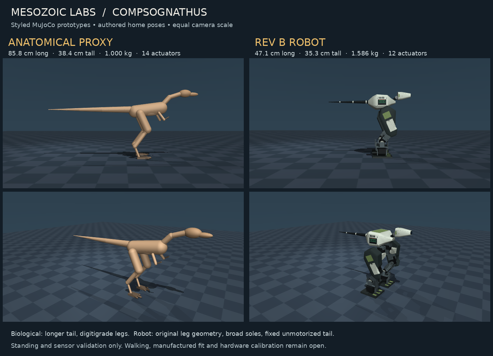
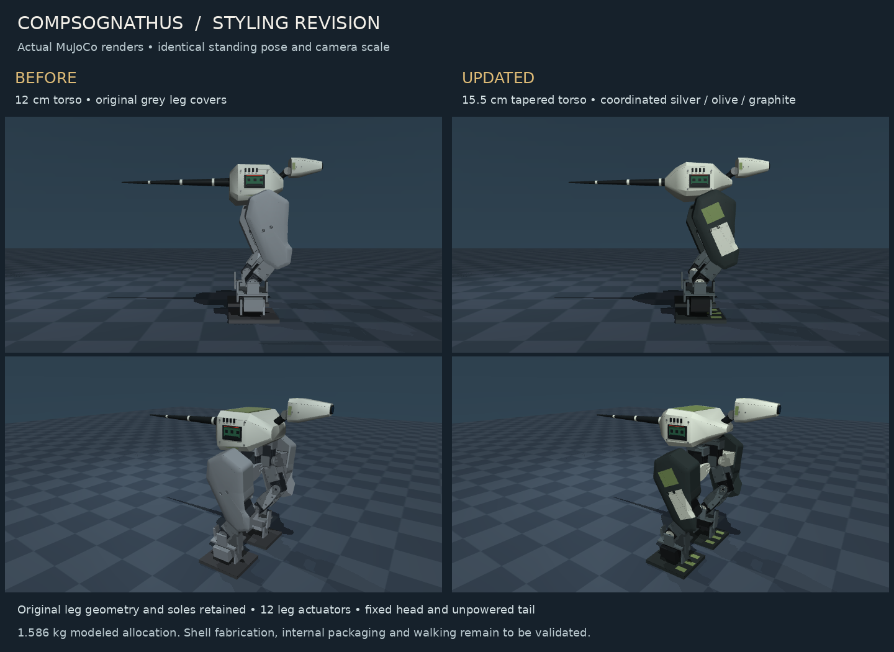

# Compsognathus Longipes: anatomical and Rev B robot models

Two MuJoCo models, added September 7, 2026, with **SB3 training integration**. Both have a
floating base, articulated legs, working ground contact, joint-angle servos,
an IMU, encoders, foot touch sensors and one forward-facing camera. Both hold
a standing pose in forward dynamics. Both now have registered Gymnasium
environments, PPO/SAC recipes, evaluation and checkpoint contracts.
**A converged walking policy has not yet been demonstrated.**



| Property | Anatomical proxy | Rev B robot |
|---|---|---|
| MJCF | `assets/compsognathus.xml` | `assets/compsognathus_robot.xml` |
| Home standing height | 38.4 cm | **35.3 cm** |
| Nose-to-tail envelope | 85.8 cm | **47.1 cm** |
| Maximum visual width | 13.8 cm | 25.8 cm, including leg hardware |
| Pelvis-frame height | 24.4 cm | **21.8 cm** |
| Model mass, excluding target | 1.000 kg, assumed | **1.5856 kg**, preserved Rev B allocation |
| Actuators | 14 | **12, all in the legs** |
| Tail | Two driven base axes and three passive distal hinges | **Fixed, 50 g allocation; no joint or motor** |
| Head | Neck pitch and jaw pitch | Fixed, 45 g allocation |
| Feet | Three toes and a small plantar pad | **100 × 90 × 8 mm** soles |

Dimensions are measured visual bounds at `home`, not manufacturing
dimensions. The anatomical proxy has a longer tail and slimmer legs; the
robot preserves the previously screened mechanism.

## Run and reproduce

From the repository root with Python 3.11+:

```bash
python -m pip install -e ".[test]"
python -m environments.compsognathus.scripts.view_model --model robot
python -m environments.compsognathus.scripts.view_model --model biological
python -m environments.compsognathus.scripts.build_models
python -m environments.compsognathus.scripts.validate_models --output /tmp/compso-preflight.json
pytest environments/compsognathus/tests environments/shared/tests/test_mjcf_assets.py
```

The repository pins **MuJoCo 3.10.0**, used for these checks. The original
Rev B package used 3.12.0. On macOS use `mjpython` for the interactive viewer.
The viewer starts at `home`, holds fixed joint-angle targets and steps real
physics. `--motors-off` disables actuation at solver level; `--mass-scale 1.15` increases
body masses and inertias while preserving motor limits.

Pictures need Pillow; videos additionally need `imageio imageio-ffmpeg`:

```bash
python -m environments.compsognathus.scripts.view_model --compare /tmp/models.png
python -m environments.compsognathus.scripts.view_model --model robot --snapshot /tmp/robot.png
python -m environments.compsognathus.scripts.view_model --model robot --head-camera --snapshot /tmp/onboard.png
python -m environments.compsognathus.scripts.view_model --model robot --video /tmp/standing.mp4 --seconds 5
```

Headless rendering needs a working OSMesa runtime with `MUJOCO_GL=osmesa`,
or EGL with `MUJOCO_GL=egl`. Model loading and physics tests need neither.

## Training

In `notebooks/sb3_training.ipynb`, choose **Compsognathus Longipes** or
**Compsognathus Longipes (Robot)** and set `ALGORITHM` to `ppo` or `sac`.
The notebook's normal training, checkpoint, evaluation, graph, video and
curriculum-gate cells apply to both variants. `QUICK_TEST` reduces the budget;
a short run may fail the advancement gate and stop, as intended.

| Contract | Anatomical proxy | Robot |
|---|---|---|
| Stable ID / config directory | `compsognathus` | `compsognathus_robot` |
| Gymnasium ID | `MesozoicLabs/Compsognathus-v0` | `MesozoicLabs/CompsognathusRobot-v0` |
| Observation dimensions | 53 | 43 |
| Action dimensions | 14 | 12 |
| Control rate / episode horizon | 50 Hz / 1,000 steps (20 s) | 50 Hz / 1,000 steps (20 s) |
| Initial locomotion velocity gate | 0.08 m/s | 0.04 m/s |

Actions in `[-1, 1]` specify position residuals about the gravity-preloaded
`home` controls, with piecewise scaling to each servo's existing limits.
Zero action holds that pose. The fixed robot head and tail acquire no
actuators. Falls, excessive tilt, and non-foot body contact with the floor
terminate the episode; time limits remain truncations for SB3 bootstrapping.

The observation contains joint positions/velocities, pelvis orientation,
angular velocity, world linear velocity, acceleration, ideal foot forces,
and target direction/distance. **These are privileged simulator-state MLP
policies.** They do not consume camera images and cannot be deployed as-is
on the robot. `env.render_head_camera()` exposes the single 640 × 480 RGB
camera separately. Real pose/velocity estimation, noisy sensors, control
latency, motor calibration and sim-to-real validation remain future work.

Each variant has three advancing stages and an opt-in recovery pilot:

| Stage | Objective and advancement criteria | Initial budget |
|---|---|---:|
| 1 / `stance` | Supported upright stance; ≥90% full-horizon episodes, unsupported duty ≤10%, its upper bound ≤15%, reward rail ≥1,800 | 11M steps |
| `recovery` (opt-in) | Recover after calibrated horizontal pushes; frozen paired-null evaluation, with provisional pilot targets | 3M steps |
| 2 / `locomotion` | Forward progress; average speed gate above, average length ≥900 and reward ≥500 | 3M steps |
| 3 / `behavior` | Upright arrival within 8 cm of the goal in XY, horizontal speed ≤0.10 m/s; success rate ≥70% and reward ≥25 | 3M steps |

The stance reward threshold is now **1,800**, raised from 1,500 to align with
Tyrannosaurus Rex's approximately 60% of measured standing baseline
(`2,100 / 3,495.2`). Both Compsognathus variants have a 3,000-point stance
ceiling: supported survival, posture, and height each contribute at most one
point per step over 1,000 steps. The anatomical baseline measured 2,998.74,
so 1,800 is also approximately 60% of that baseline; the robot uses the same
ceiling-based threshold and still requires its own baseline evaluation.
This is a fixed progression threshold, not automatic baseline normalization
or a claim that either learned policy will converge. The 20-second horizon,
support criteria, and other stages retain their existing settings. Existing
runs retain their captured 1,500 threshold; the new threshold applies when
the updated stage configuration is loaded for a subsequent run.

The three advancing stages request at least 20 evaluation episodes and three consecutive
passing checkpoint evaluations. The notebook also applies the shared
publication gate to the selected checkpoint's evaluation evidence. These
thresholds and 17M-step totals (20M with the recovery pilot) are **experimental recipes**, not calibrated claims
about convergence time. The target is a non-contact marker: success is
`target_success`, distinct from the generic 0.5 m proximity diagnostic.
The robot does not bite or move its fixed head to reach the marker.
Recovery uses a separate frozen 40-episode panel and does not automatically
feed its checkpoint to locomotion. See [recovery calibration](RECOVERY_CALIBRATION.md)
for the measured disturbance, physical judge, and qualification limits.
The notebook normally uses the full per-stage allowance before its publication
gate. The CLI `curriculum` runner can advance early on consecutive passes.

The [September 8 recipe review](TRAINING_RECIPE_REVIEW.md) uses current
Tyrannosaurus Rex training as the reference; the older species' successful
runs do not validate recipes on the updated library. PPO now uses a linear
learning-rate schedule from `3e-5` to `1e-5`, `target_kl=0.03`, and entropy
decay. Stance decays entropy from `0.005` to zero over 7M steps; recovery
decays to zero over 2M, while locomotion and target reaching decay to `0.001`
over 2M. Their explicit 100k-step PPO transition warm-up
uses `0.005` entropy rather than inheriting the generic `0.02` boost.
The 128×128 network and small initial action standard deviation remain.
The stage budgets also apply to SAC; the notebook preserves its existing
SAC transition behavior. Its learning performance is still unvalidated.

Use a fresh run to evaluate this recipe. Existing runs retain their captured
configuration; loading a checkpoint with the new settings creates a mixed
experiment. The notebook reads these TOMLs through its existing loader, so
restart the runtime and load the updated checkout before a new run.

The nominal standing pose already supports zero-action balance. Measure
that baseline before interpreting any return improvement; stance is a
foundation, and passing it does not establish locomotion or active recovery.
The support gate also does not require bilateral loading at every step.
Set `RUN_RECOVERY_STAGE = True` after a passing stance run to enable the
calibrated recovery pilot. The notebook freezes its null comparisons before
training and saves per-episode and per-push evaluation evidence afterwards.
Automatic reward-collapse
stopping is deliberately unarmed until this plant has suitable calibration
data; advisory baseline reporting and the advancement gates remain active.

From the repository root:

```bash
python -m pip install -e ".[train,test,viz]"
python -m environments.shared.train --species "Compsognathus Longipes" train --stage 1
python -m environments.shared.train --species "Compsognathus Longipes (Robot)" curriculum --n-envs 4
python -m environments.shared.scripts.zero_action_baseline compsognathus compsognathus_robot --episodes 20
pytest environments/compsognathus/tests environments/shared/tests/test_compsognathus_training.py
```

The final command includes real, small CPU PPO/SAC runs through all three
shared-trainer stages, checkpoint handoffs and the actual notebook training
function. The tests shorten horizons and budgets while preserving the
production gate criteria; they verify infrastructure, not learned behavior.
The `configs/<variant>/sweep_ppo.json` and `sweep_sac.json` files provide
conservative initial algorithm search spaces for the Ray Tune notebook.
Distributed sweep execution is a separate optional runtime.

Both variants explicitly support **SB3 only**. They are absent from the
JAX notebook selector until MJX environments and backend parity tests exist.
The plant contract fingerprints the actual SB3 interface and records separate
anatomical/robot identities; a checkpoint from one variant is rejected by
the other. Save each checkpoint with its matched VecNormalize sidecar.

The training integration also corrects `diagnostic_pelvis_quat` and
`diagnostic_pelvis_velocity` to use MuJoCo's body frame (`xbody`). The previous
`body` quaternion reported the inertial principal axes, making the upright
anatomical pelvis appear tilted by about 1.44 radians. Regression tests
compare the quaternion sensor to the body axes at multiple orientations.
This changes diagnostic sensor semantics, not the mass allocation or mechanism.
The older `preflight_v3.json` remains historical model evidence.

## Preserved robot design

`references/compso_rev_b.xml` preserves the original September 6 Rev B model.
The generator verifies its SHA-256 and uses the original first
double-support pose stored in `data/model_parameters.json`. Body transforms,
joint signs/ranges and leg/core inertials remain unchanged. The head's
45 g allocation uses the component COM and inertia established in v1.
The v3 mechanical enclosures retain those aggregate mass proxies; their panel
surfaces are not used to infer the mass of solid metal blocks.
The tapered tail retains its conservative 50 g Rev B aggregate inertial
allowance, including its attachment; this is not a uniform-density tail CAD.

Each leg has hip yaw, hip roll, hip pitch, knee pitch, ankle pitch and ankle
roll. **Both thigh and shin parallel shaft separations are 78.65 mm**. The
ankle adapter adds 40 mm from pitch to roll and 38 mm from roll to sole.
Home foot-centre spacing is 130 mm. Shaft separation is measured
perpendicular to the axis, avoiding the misleading along-shaft offsets in
the source joint origins.

The candidates are **two STS3250-C001 hip-roll servos and ten STS3215-C018
12 V servos**. This supersedes the older ten-leg-plus-two-neck-axis estimate.

| Mass allocation | Mass |
|---|---:|
| Core: battery, computer, yaw servos, power distribution, wiring and structure | 505 g |
| Fixed head and sensor allowance | 45 g |
| Fixed tail and attachment | 50 g |
| Two complete leg assemblies | 985.6 g |
| **Total** | **1,585.6 g** |
| **15% growth scenario** | **1,823.44 g** |

The head and tail are already included. These are allocated/inherited CAD
masses, not weighed hardware. The core remains an aggregate envelope, not
a verified arrangement of the battery, boards and regulator. Decorative
mounts and the camera lens use existing inertial allowances.

The fixed head allocates **22 g rear shell, 8 g nose housing, 5 g lower shell,
6 g camera module/lens and 4 g mount**. These overlapping primitive envelopes
are now hidden mass proxies. A chamfered outer camera housing supplies the
visible shape and external collision envelope. Panels, screws and window
details fit the existing head/core allowances, not additional mass-free
hardware. The camera dimensions and 6 g allowance require a real part
selection before fabrication. Recalculate mass/inertia from the selected
parts and actual shells before treating this as a manufacturing model.

## Appearance and sensor layout

Brown/tan body, belly, head and claw materials use the T-Rex asset's palette.
The anatomical proxy uses rounded torso/neck forms, an elongated small skull,
three functional toes, a tibia longer than the femur and a continuously
tapered long tail. Colours express repository styling, not known fossil
colouration. It remains an anatomy-inspired proxy rather than a specimen scan.
The anatomical head has no eyes, teeth or lip rim. Its plain lower-jaw proxy
blends inside the closed snout while preserving the articulated jaw and 7 g
mass allocation.

The robot's v3 styling combines the silver/olive finish of the September 6
**Mesozoic Labs Biped Robot Concept.png** with lessons from Microduck's visible
mechanics and coordinated colour accents. The core casing is now **155 mm
long, 130 mm wide and 74 mm high**, versus 120 × 130 × 80 mm in v2. Tapered
ends and a raised belly preserve a distinct neck and reduce overlap near the
hip mounts. Its six cross-sections are in `data/model_parameters.json`.

The original large leg covers remain present, visible and collision-enabled.
They now have a graphite finish with narrow olive/silver colour fields clipped
to their surfaces. These are surface finishes with an 80 micrometre rendering
offset, not removed brackets, replacement covers or additional structural
plates. Servo housings are dark; selected mounting hardware matches the body.
Three painted toe cues sit within each unchanged sole. No weight savings are
credited to these appearance changes.

The tapered camera housing, dark fixed neck and passive tail with rigid collars
remain. **All twelve motors are in the legs.** The camera and IMU poses, joint
centres, link lengths, actuator settings and inherited inertials are unchanged.
The 505 g core allocation is a design target, not proof that a fabricated
155 mm casing and selected electronics meet the budget. Hollow-shell CAD,
wall thickness, fasteners, mounting and actual mass/inertia still need design.



The comparison uses identical poses and camera scale. It is an actual MuJoCo
render, not a generated illustration. To reproduce it or the local envelope
screen, recover the previous robot XML from the v2 commit:

```bash
git show 11d8469fb6973fa5638ce9f491f25f739ece3de9:environments/compsognathus/assets/compsognathus_robot.xml > /tmp/robot_v2.xml
python -m environments.compsognathus.scripts.render_style_comparison --before /tmp/robot_v2.xml --output /tmp/style.png
python -m environments.compsognathus.scripts.validate_shells --reference /tmp/robot_v2.xml --output /tmp/shell-screen.json
```

`data/sensor_layout.json` defines the mounting frames and signal contract:

| Signal | Baseline and mounting | Simulation limitations |
|---|---|---|
| Single RGB camera | Fixed snout; 640 × 480, 70° vertical FOV; forward +X | Pinhole camera, no depth; hardware optics and timing not identified |
| Gyroscope + accelerometer | Inside core at pelvis coordinates (−2, 0, 70) mm | Local angular velocity and specific force; no calibrated noise or bias |
| Joint position/velocity | All 12 servos, in actuator order | Ideal feedback; velocity may need estimation from bus positions |
| Foot normal force | Optional, one ideal touch volume per foot | Physical pads, ADC, wiring and their masses still need selection |
| Orientation/world velocity | `diagnostic_*` only | Simulator ground truth, excluded from the onboard adapter |

`sensors.onboard_readings` returns copied SI-unit IMU/encoder readings.
Foot forces require `include_foot_contacts=True`; images are rendered
separately through `head_camera`. An accelerometer measures specific force:
about +9.81 m/s² along upright stationary Z, approximately zero in free fall.
Orientation on the real robot requires an estimator. The lens is ahead of
the head geometry; tests include its own body when checking optical rays.

This is the single-camera tier. It does not assume an additional depth
camera, lidar, perfect pose sensor, or a motorized sensor head.

## Actuation and contact assumptions

Robot position servos use `kp=25 N·m/rad`, `kv=0.2 N·m·s/rad`, `gear=1`
and absolute-radian command limits matching the joints. These gains are
**simulation assumptions**, not identified Feetech parameters. The derivative
term is inside the torque clamp. Passive joint damping is only 0.005
N·m·s/rad; armature is an assumed 0.0001 kg·m².

Both `home` keyframes include **offline gravity preload**: nonnegative
vertical foot loads balance weight and COM moments; contact Jacobians give
the nominal joint torques, converted to `tau/kp` position-target offsets.
Home joint angles stay unchanged. No external root force, weld, hidden
ballast or online ground-truth balance feedback is added. This nominal
preload is kept unchanged in mass-growth trials. `standing_targets.py`
reproduces it and rejects torque or control-limit violations.

Robot damping was reduced from the original 0.4 to 0.2 to remove transient
rocking in the reset trials. The biological leg actuators also use 0.2.
These are simulation tuning results, not measured motor responses. Contact
time constants are 8 ms for the robot and 6 ms for the anatomical proxy,
with a 50 µm contact margin; neither is a substitute for material testing.

The caps are manufacturer **rated** torque multiplied by an assumed 11.5/12
voltage factor and 0.9 derating: approximately **±1.3533 N·m at hip roll**
and **±0.8458 N·m elsewhere**. They are not stall-torque allowances.

These are constant torque limits, not an identified torque-speed,
electrical or thermal model. No-load speeds are retained as reference
parameters but are not enforced by the MJCF. Backlash, delay, voltage sag
and heating remain open. The model assumes a regulated 11.5 V motor rail:
the STS3250 specification stops at 12 V, so a fully charged 12.6 V 3S pack
is not qualified for direct connection. Power hardware must fit the core
mass allocation or trigger a revision.

Robot mechanical geoms collide with the floor. Opposite legs collide with
one another and with the head/tail envelopes. **Within-leg mating parts are
excluded by masks**, and the aggregate core only collides with the floor.
These exclusions prevent artificial forces at intended mechanical
interfaces but preclude a full self-collision clearance claim. Convex mesh
contacts do not establish cable, horn, connector, fastener or bracket fit.

The anatomical proxy uses primitive geometry with normal parent/child
filtering. All three toes and the plantar pad belong to their touch
sensor's rigid foot body, so distal contact is captured. The pad and soft
tissue are simulation approximations, not a fossil-fitted reconstruction.

## Validation scope

`data/preflight_training_v1.json` records current model hashes and all 26
standing-protocol trials after the diagnostic sensor correction. See
[training validation](TRAINING_VALIDATION.md) for the training-specific checks.

`data/preflight_v3.json` records the pre-training v3 model/validator hashes, dimensions,
masses, contact loads, torque utilisation and explicit acceptance thresholds.
`preflight_v0.json` through `preflight_v2.json` are historical evidence for earlier revisions.
`data/validation_summary_v3.json` records **105 passing targeted tests**,
including the existing T-Rex and raptor static-balance suites, plus all
26 preflight trials. This is not a claim that the entire repository test
suite or the training stack was exercised.

| Worst active-trial metric | Anatomical proxy | Robot |
|---|---:|---:|
| Pelvis tilt | 0.86° | 1.00° |
| Horizontal drift | 5.41 mm | 3.54 mm |
| Minimum settled COM support margin | 18.51 mm | 34.82 mm |
| Peak fraction of configured torque cap | 67.7% | 85.9% |

These maxima/minima include the specified reset trials and mass-growth
scenario. Torque utilisation does not establish speed or thermal headroom.

- Both stand for **ten seconds** with fixed angle targets, finite state,
  torque limits respected and support exclusively through their feet.
- Each stands after **ten seeded ±1° joint-position perturbations**,
  five seconds per trial. The floating base is translated vertically so
  noisy feet start 50 µm above the floor, instead of penetrating it. Angles
  and targets are not changed by this reset clearance correction.
- Both stand at **1.15× mass/inertia** with unchanged motor limits and targets.
- Foot sensors account for ground support, and the standing centres of mass
  lie inside the contact support polygons.
- Both lose the standing pose when motors are disabled: no hidden weld or
  large passive joint spring supplies the posture.
- At 50 Hz after the first 0.5 seconds: COM stays at least 5 mm inside the
  loaded-contact hull, each foot carries at least 20% of support, total
  load stays within 3% of weight and touch readings account for it within 0.5%.
  No missing or degenerate support polygon is silently skipped.
- Over the whole trial: tilt stays below 5°, pelvis drop below 5 mm,
  horizontal drift below 10 mm and contact penetration below 1 mm.
  Non-foot floor contact and penetration are checked at every physics step.
- Tests cover knee travel using the existing species' shared test helper,
  six independent robot foot-control axes, original Rev B mechanism inertials
  and every original leg collision mesh/transform,
  head mass/COM/inertia, true actuator disabling and restoration, per-foot
  touchdown sensing, IMU units, encoder order and 63 optical rays per camera.

`data/shell_screen_v3.json` separately compares v2 and v3 at **113 local poses**
against **80 original leg geoms**, using direct signed distances that ignore
the core-leg contact masks. It finds no newly introduced overlap exceeding
0.5 mm and no penetration worsened by more than 1 mm in this sample. At home,
two existing solid-envelope overlaps with the upper hip-mount meshes reduce
from approximately 11.5 mm to 2.7 mm. The casing is a convex solid proxy, so
these results require interpretation against real hollow-shell and mount CAD.
This is a discrete comparison around home, not a complete range-of-motion
clearance proof, and it does not validate internal component packaging.

There is no demonstrated learned gait, deliberate push test, uneven terrain,
battery-runtime result or fabrication-ready assembly. The earlier Rev B
341-pose clearance/load screen remains historical prescribed-motion
evidence; it is not a forward-dynamics walking result for this model.

## Repository integration and next steps

The anatomical model follows the T-Rex/raptor `+X forward, +Y left, +Z up`
convention, `pelvis` root, limb names, mocap prey, sensors and `home` keyframe.
The robot retains upstream `left_`/`right_` joint names and mirrored signs
for traceability. Raw MJCF controls are **absolute angles in actuator order**;
the Gymnasium wrappers map normalized residual actions onto those angles.

Both variants are in the model inventory, species catalog, SB3 registry,
plant contracts and CI suites, with separate observation/action contracts
and three-stage recipes. Next steps are measured training of weight transfer,
slow walking and target reaching, plus loaded-servo identification. Before
hardware deployment, replace privileged simulation state with estimated,
onboard-observable quantities and validate transfer with the tail kept fixed.

## Sources

- [T-Rex](../trex/assets/trex.xml) and [raptor](../velociraptor/assets/raptor.xml): repository conventions.
- [Open Duck Mini v2, pinned commit](https://github.com/apirrone/Open_Duck_Mini/tree/b23317a485b3cec7d8417f352478778b3475173c): inherited robot material via Rev B; see [attribution](references/NOTICE.md).
- [Scott Hartman's Compsognathus reconstruction](https://www.skeletaldrawing.com/theropods/compsognathus-longipes/): approximate scale/silhouette reference, including an 85 cm reconstruction. No illustration was copied. The proxy's 95/114/64 mm leg lengths, mass, joint limits and soft tissues are engineering choices, not measurements from that drawing.
- [Bidar, Demay and Thomel (1972), Smithsonian-hosted translation](https://naturalhistory.si.edu/sites/default/files/media/translated_publications/Bidar%26amp%3B%25201972.pdf): anatomical context for longer tibiae, slender metatarsals and three functional foot digits; not used for current taxonomic or palaeoecological claims.
- [Feetech STS3215-C018](https://www.feetechrc.com/525603.html) and [STS3250](https://www.feetechrc.com/562636.html): ratings carried forward from the September 6 Rev B research.
- [MuJoCo 3.10 position actuators](https://mujoco.readthedocs.io/en/3.10.0/XMLreference.html#actuator-position): servo and force-limit semantics.
- [Pollen Robotics: Meet Microduck](https://pollen-robotics.com/microduck/blog/introducing-microduck/) and [official press kit](https://pollen-robotics.com/microduck/press-kit/): character through silhouette, visible mechanics and coordinated colours. Styling inspiration only; no Microduck geometry, electronics, proportions or walking qualification is transferred to this heavier robot.
